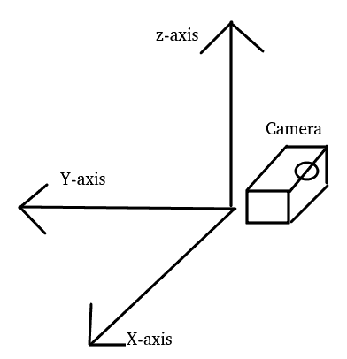
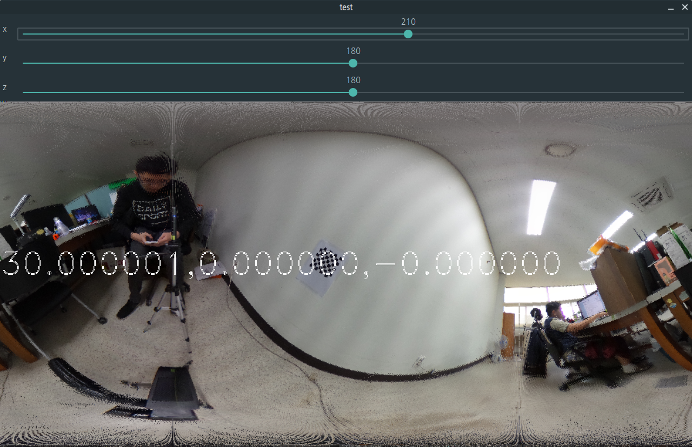
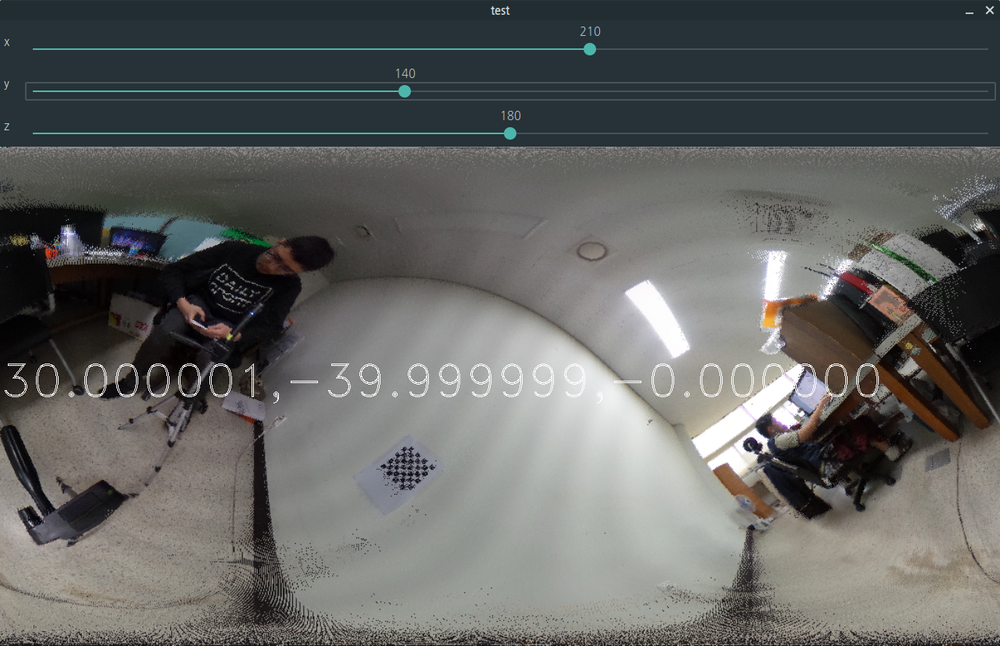

# live_rotation_test
Show simple example of rotation in ERP with live viewing. 

## Rotation and projection method
XYZ order eular rotation with below axis.  
Currently, simply show Forward mapping of original image with Rotation matrix

## Dependancy
Tested version of OpenCV : OpenCV 3.4.2

## Rotation test

